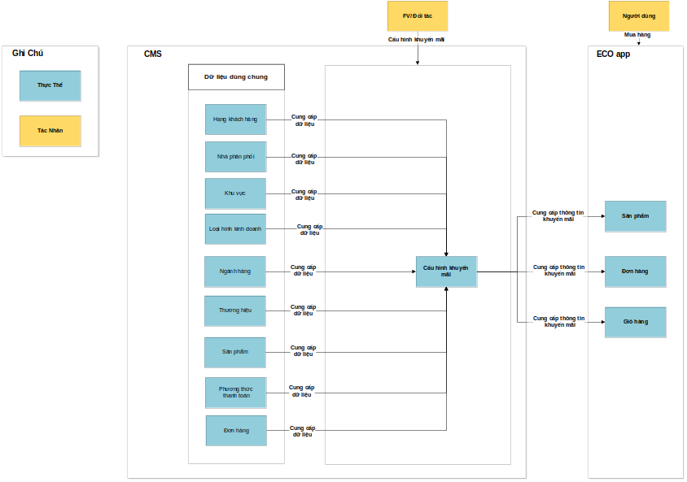
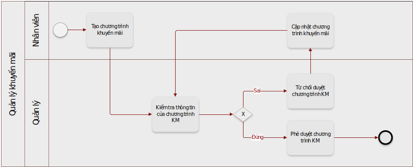
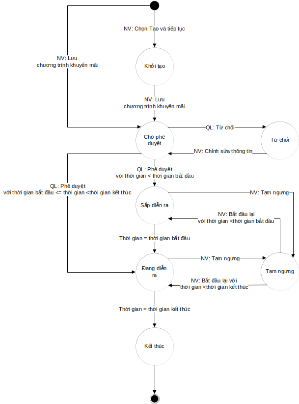

# Promotions

- [Promotions](#promotions)
  - [Giới thiệu](#giới-thiệu)
  - [Đối tượng sử dụng](#đối-tượng-sử-dụng)
  - [Nghiệp vụ chung](#nghiệp-vụ-chung)
    - [Mô hình quan hệ thực thể:](#mô-hình-quan-hệ-thực-thể)
    - [Quy trình nghiệp vụ:](#quy-trình-nghiệp-vụ)
    - [Sơ đồ chuyển đổi trạng thái](#sơ-đồ-chuyển-đổi-trạng-thái)
  

## Giới thiệu
Xuất phát từ vấn đề thay đổi định hướng cho hệ thống phân phối. Hệ thống hiện tại chưa đáp ứng được yêu cầu được đưa ra. Do đó app ECO được cập nhật để đáp ứng các yêu cầu về nghiệp vụ. Tài liệu đặc tả yêu cầu nghiệp vụ sẽ:
  -  Xác định phạm vi về mục tiêu nghiệp vụ của hệ thống, các chức năng và các đơn vị tổ chức sử dụng hệ thống.
  - Xác định các quy trình nghiệp vụ mà giải pháp cần đáp ứng
  - Tạo điều kiện cho sự hiểu biết chung về các yêu cầu chức năng đối với tất cả các bên liên quan,
  - Thiết lập một cơ sở để có cái nhìn chung cho toàn bộ các đơn vị liên quan về yêu cầu chức năng trong hệ thống.
## Đối tượng sử dụng

Tài liệu này được sử dụng cho các đối tượng sau:
- Developer: Lên kế hoạch phát triển và thực hiện lập trình logic.

## Nghiệp vụ chung
### Mô hình quan hệ thực thể:

 ### Quy trình nghiệp vụ:
 

 ### Sơ đồ chuyển đổi trạng thái

Cần phân tích: 
- Thứ nhất điều là Consumer có nhất thiết phải phân biệt thành nhiều kênh không?(Chỉ vì phụ thuộc vào đối tác)
- Thứ hai phải xem xét bản chất mua hàng trên ECO web là như thế nào?
- Thứ ba nếu bản chất chỉ là mua hàng để thanh toán qua app MB BANK (hiện tại) thì xem xét có thể  xét qua điều kiên Phương thức thanh toán là Mb bank ( thì có thể thực hiện được các ctkm như này Quà tặng, Hoàn tiền khi mua hàng trên ECO web app qua MB Bank)
---------------------------------------------------

[SUMMARY](./SUMMARY.md)