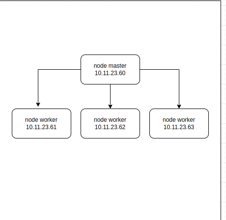
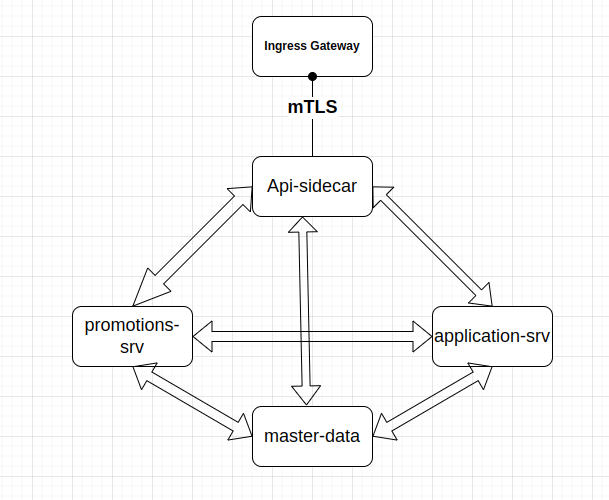

## Devployment
* Tìm hiểu về kubernet, và consul trong kubernet
  * Hiểu được cơ chế cũa k8s 
  * StatefulSets ?
* round-robin.
* Kubernetes Best Practices: Blueprints for Building Successful Applications on Kubernetes -->

## Hoạt động cluster promotions
### Hiểu một cách tổng quan: 
 Hiện tại cluster của promotion có 3 tổng 4 nodes trong đó có 1 node master và 3 node workers 
* Trong đó :  
  - `Node Master `làm nhiệm vụ quản lý toàn cluster.
  - `Node worker` khởi chạy các ứng dụng trực tiếp trên đó là các Worker.
  
  
`Node Master chịu trách nhiệm quản lý cluster`. Nó quản lý toàn bộ các hoạt động bên trong cluster, như là việc khởi chạy các ứng dụng, kiểm soát chúng để chắc chắn chúng luôn ở các trạng thái như mong muốn, thay đổi khả năng đáp ứng của chúng (scaling), hoặc triển khai các phiên bản nâng cấp theo thời gian.

 `Node worker khởi chạy các ứng dụng trực tiếp trên đó là các Worker.` Mỗi Node có một chương trình chạy thường trực bên trong tên là Kubelet, làm nhiệm vụ quản lý Node và duy trì kết nối với node Master. Mỗi Node bên cạnh đó còn chạy các chương trình dùng để khởi chạy và quản lý các Container như Docker hay rkt. Mỗi một Kubernetes cluster được triển khai trong thực tế khai thác thường có ít nhất 3 node thuộc 2 loại như bên trên.

### consul hoạt động theo kiểu

- Khi gọi 1 Request vào cluster k8s thì `Ingress` sẽ tự động kiểm tra cân bằng `traffic` và sẽ tự động điều hướng tới các `node worker`
- Ingress là gì?
   - Ingress là một giải pháp để quản lý, điều phối các truy cập (đa phần là HTTP, HTTPS) từ bên ngoài vào các services trong cụm kubernetes.
   - Ingress gồm 2 thành phần chính:
    `Ingress Resource`: định nghĩa các routing rule. Rule này dựa vào đặc tính của request gửi đến và quyết định request sẽ được điều phối tới service nào.
- Service mesh là gì ? 
  - nếu Ingress là giải pháp điều phối kết nối từ bên ngoài vào trong cụm kubernetes, thì Service mesh là giải pháp để giao tiếp nội bộ giữa các thành phần trong cụm kubernetes.
  - Trong k8s có hai cách thức chính để các ứng dụng có thể giao tiếp với nhau:
  `Pod to Pod`: các pod trao đổi trực tiếp với nhau. Cách làm này không được khuyến khích, do mỗi lần pod restart, nó sẽ được gán IP mới dẫn đến việc mất kết nối tới các pod khác.
  `Service:` pod trao đổi với nhau thông qua Service. Service là đối tượng chỉ mất đi khi bạn chủ ý xóa, nó vẫn sẽ giữ được kết nối tới pod nếu pod restart (với label/selector).

- `Vấn đề ` nằm ở chỗ, cả hai kiểu giao tiếp này đều `không được mã hóa`, gây `nguy cơ mất an toàn thông tin` cho hệ thống.  
- `Giải pháp` cho vấn đề này chính là Service mesh.

## Service mesh Consul 
- `Service mesh` (hiện tại promotion đang dùng consul Service mesh) cung cấp các chức năng chính:
  - Kết nối các service trong cụm kubernetes
  - Mã hóa gói tin liên lạc
  - Theo dõi, quan sát việc giao tiếp giữa các service, từ đó người dùng có thể troubleshoot, maintain hoặc đưa ra quyết định tối ưu hệ thống.

Service Mesh gồm có hai thành phần chính là `control plane` và `data plane`:

- `Control plane` sẽ thực hiện vài trò là quản lý toàn bộ các services. `Control plane: đóng vai trò như Service registry. Ngoài ra còn lưu trữ config tập trung, quản lý, điều phối Sidecar proxy`.
- `Data plane` sẽ đóng vai trò xử lý giao tiếp giữa các services.
Khi ta triển khai service mesh lên trên K8S thì lúc này data plane sẽ là phần sidecar container proxy được triển chung với application container, còn control plane sẽ được triển khai như một Pod riêng biệt.

Lúc này thay vì quản lý việc giao tiếp với nhau thông qua `kube-proxy`, thì ứng dụng của ta sẽ giao tiếp với container proxy, và container proxy sẽ thực hiện việc giao tiếp giữa các Pod với nhau. Tất cả các chức năng như bảo mật, giám sát, đo lường thì container proxy sẽ thực hiện hết, còn ứng dụng của ta chỉ cần tập trung vào phần application logic.

## Cấu trúc của 1 Pod của promotions

  - `envoy-sidecar container` đóng vai trò là data plane của 1 pod giao tiếp với những pod khác
  - `promotion-svc container` là bussiness chính xử lý
  
khi `promotions-svc` muốn gọi qua con `master-data `thông qua `grpc-gateway` thì `proxy`  sẽ request tới `control-plane`, `control-plane` sẽ điều phối tới pod của master-data tương ứng